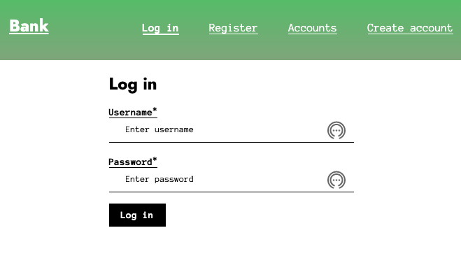
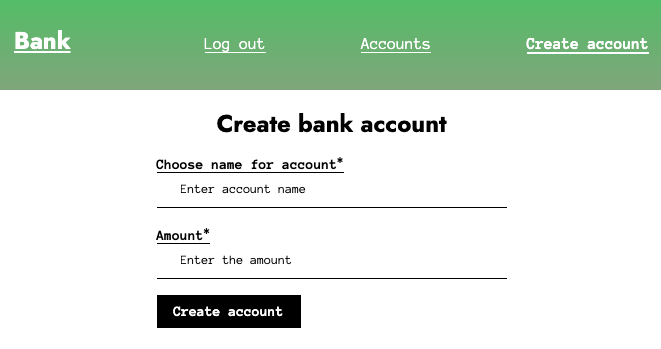
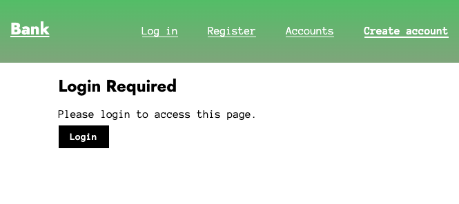
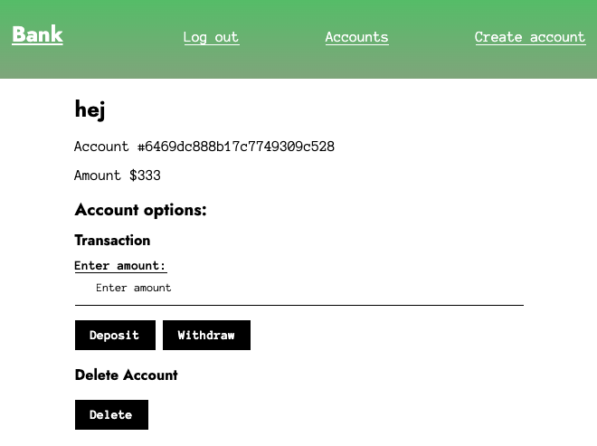

# mongoDB-bank

Simple bank application built with Node.js, MongoDB, and Express.js. The application allows users to register, create accounts, and perform banking operations. The backend server is implemented using Express.js and MongoDB is used as the database to store user information and account details. The application is designed as a Single-Page Application (SPA) using vanilla JavaScript classes for the implementation of the client-side routing.


## Features:
- User registration and login
- Creation and management of bank accounts
- Deposits, withdrawals, and balance updates
- Secure password storage using bcrypt hashing
- 
## Views

Login             |  Create bank account
:-------------------------:|:-------------------------:
  |  

Login required             |  Bank account details
:-------------------------:|:-------------------------:
  |  

## API Endpoints

* ```GET /api/accounts``` - Get all accounts for the authenticated user.
* ```POST /api/accounts``` - Create a new account for the authenticated user.
* ```GET /api/accounts/:id``` - Get a specific account by ID.
* ```PUT /api/accounts/:id/update-amount``` - Update the balance of a specific account.
* ```PUT /api/accounts/:id/update-fields``` - Update the fields of a specific account.
* ```POST /api/user/register``` - Register a new user.
* ```POST /api/user/login``` - Log in an existing user.
* ```POST /api/user/logout``` - Log out the current user.
* ```GET /api/user/active ``` - Get the active user.

## Getting Started

### Make sure you have the following installed:
* Node.js
* MongoDB

### Clone
* ```https://github.com/stormstina/mongoDB-bank.git```

### Dependencies
* ```npm install```

### Run
*  ```node server```
*  The application will be running on [http://localhost:3000](http://localhost:3000)


